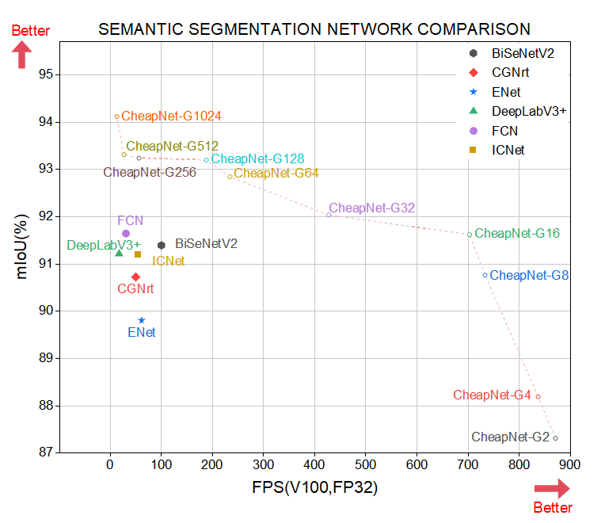

# CheapNet

CheapNet: Ultra-Lightweight Real-time Network for Semantic Segmentation and Defect Detection

The original paper can be found [here](https://github.com/hanknewbird/CheapNet/blob/main/result/CheapNet.pdf).

<figure>

<figcaption> Comparisons of inference speed/accuracy tradeoff on DAGM sets. Inference speed of CheapNet are measured on an NVIDIA GTX V100 GPU.</figcaption>
</figure>


## Getting Started

### Requiremenets

| Package     | Version      |
| ----------- | ------------ |
| torch       | 1.9.0+cu111  |
| torchvision | 0.10.0+cu111 |

### Train in Command Line

First, use the tools in the dataset folder to prepare the DAGM dataset. Then run 'python train_cheapNet.py' to start training CheapNet.

```
python train_cheapNet.py.py
```

### Predict in Command Line

If you want to use CheapNet-S for prediction, please run the following command.

```commandline
python predict.py
```

### Files in Repository

| File              | Content                                                     |
| ----------------- | ----------------------------------------------------------- |
| comparison        | Store the pre training model and result graph of CheapNet-S |
| datasets          | Tool classes for processing datasets                        |
| image             | Graph of segmentation results under various thresholds      |
| model             | Set G different best pre training models                    |
| result            | Various documents generated during training                 |
| test              | Here is the test version of the tool class                  |
| tools             | Tools                                                       |
| config.py         | CheapNet Training Profile                                   |
| predict.py        | Forecast file                                               |
| train_cheapNet.py | Master Training File                                        |
| get_FPS.py        | Get Model FPS                                               |
| get_result.py     | Obtain results in coco format                               |
| np_two_pass.py    | Two-pass code written using numpy                           |


## Citation

Cite as below if you find this repository is helpful:

```
Not yet published
```
